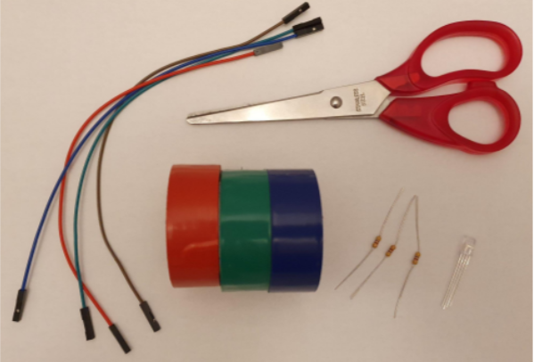
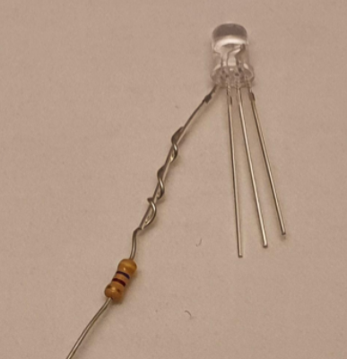
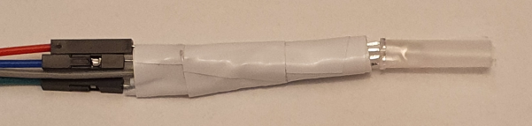

## جمع المكونات

سوف تحتاج:
+ 4 × أسلاك توصيل من نوع مقبس-مقبس، تشمل بشكل مثالي الأحمر والأخضر والأزرق
+ 3 x مقاومات نفس القيمة، حوالي 220 أوم (100 أوم أو 470 أوم جيدة أيضًا)
+ 1 × مصباح الكاثود RGB LED
+ شريط كهربائي، أي لون مناسب
+ مقص

## ابحث عن الساق الحمراء لمصباح RGB LED

يحتوي مصباح الكاثود RGB LED المشترك على ساق واحدة أطول من البقية وهي الكاثود ويجب توصيلها بالأرض (GND). تحقق من مواصفات مصباح RGB LED الخاص بك ولكن ترتيب الأرجل عادة ما يكون أحمر، كاثود (أطول ساق)، أخضر ، أزرق.

افصل بعناية الساق الحمراء من مصباح LED.

## قم بلف المقاومة حول الساق الحمراء لمصباح LED

إثنِ إحدى أرجل المقاومة حول الساق الحمراء لمصباح LED. قم بلف ساق المقاومة حول ساق LED حوالي ثلاث مرات.

## قم بتأمين المقاومة بإستعمال شريط كهربائي

قص قطعة صغيرة من الشريط الكهربائي والصقها حول المقاومة الملتوية. هذا سيساعد على جعلها أكثر أمانا.

## كرر للأرجل الخضراء والزرقاء

أضف مقاومة مثبتة بشريط كهربائي إلى الأرجل الخضراء والزرقاء في مصباح RGB LED.

## قم بتوصيل اسلاك التوصيل الأربعة

قم بتوصيل سلك توصيل بالطرف الآخر من كل مقاومة. اختياريًا يمكنك قطع حوالي 1 سم من نهاية كل سلك مقاوم لتسهيل دفع السلك في مآخذ توصيل الأسلاك. من المفيد أن تتطابق أسلاك التوصيل مع ألوان الأرجل ولكنها ليست ضرورية.

يمكنك أيضًا استخدام شريط كهربائي إضافي لعزل أرجل المقاوم حتى لا تتلامس عن طريق الخطأ. وسيساعد هذا أيضًا على تثبيت أسلاك التوصيل.

قم بتوصيل السلك الآخر بالساق السالب (الكاثود) لمصباح LED.

**نصيحة**: إذا كانت هناك أي وصلات مفكوكة يمكنك لفها. يمكنك أيضًا إضافة المزيد من الشريط الكهربائي حول جميع الأسلاك لتقليل الضغط على المفاصل.

يمكنك تجميع جميع أسلاك التوصيل معًا ولف الشريط الكهربائي حولها، وتأكد من فصل الأرجل والأسلاك المعدنية حتى لا تتلامس. إذا كان لديك مصباح RGB LED شفاف، فيمكن استخدام شريط لاصق غير مرئي (شريط شفاف) لتشتيت الضوء.

