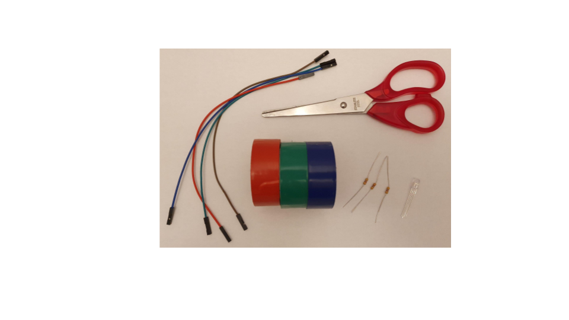
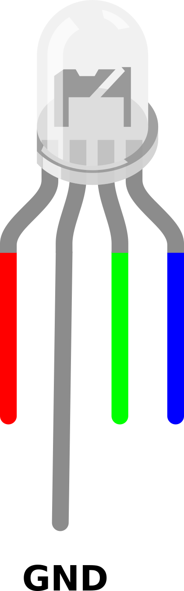
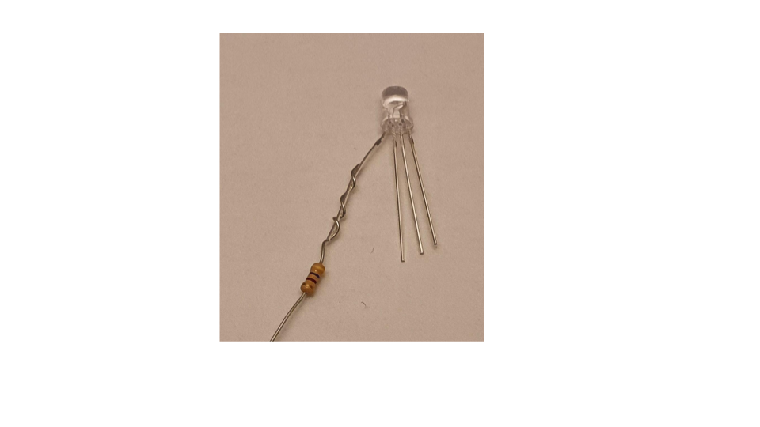
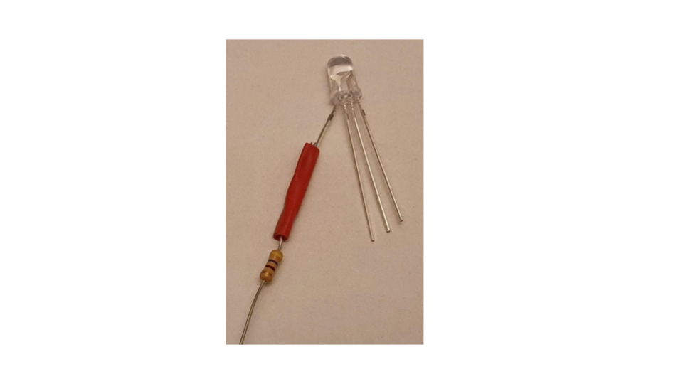
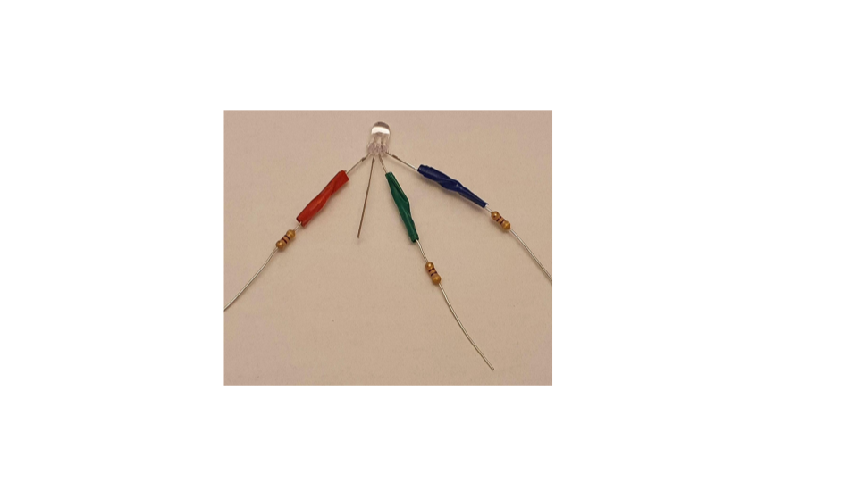
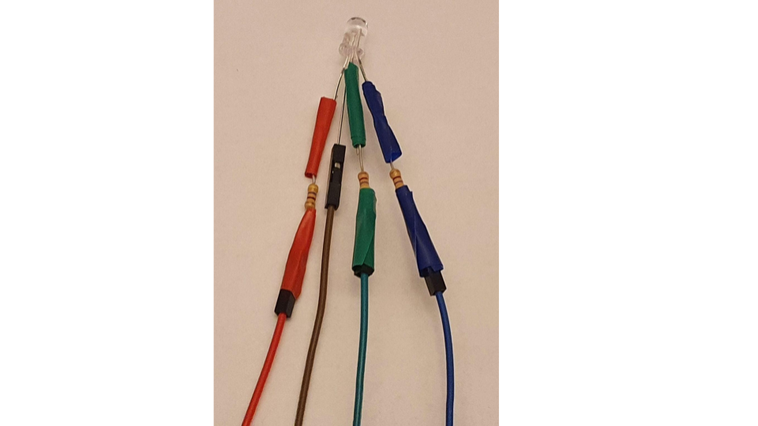

## Gather components

You will need:
+ 4 x socket-socket jumper wires, ideally including red, green and blue
+ 3 x same value resistors, around 220 Ohm (100 Ohm or 470 Ohm are also fine)
+ 1 x common cathode RGB LED
+ Electrical tape, ideally any colour is fine
+ Scissors

## Find the red leg of the RGB LED

A common cathode RGB LED has one longer leg which is the cathode and needs to be connected to ground (GND). Check the specification for your RGB LED but the order of the legs is usually red, cathode (longer leg), green, blue.  

Carefully separate the red leg of the LED.

## Twist the resistor around the red leg of the LED

Bend one of the legs of the resistor around the red leg of the LED. Twist the resistor leg around the LED leg around three times. 

## Secure the resistor with electrical tape

Cut a small piece of electrical tape and stick it around the twisted resistor. This will help to make it a bit more secure.

## Repeat for the green and blue legs

Add a resistor secured with electrical tape to the green and blue legs of the RGB LED.

## Attach the four jumper wires

Attach ae jumper wire to the other end of each resistor. You can optionally cut around 1cm from the end of each resistor wire to make it easier to push the wire into the jumper wire sockets. It's helpful if the jumper wires matches the colours of the legs but not essential.

You can also use extra electrical tape to insulate the resistor legs so that they don't accidentally touch. This will also help to secure the jumper wires. 

Attach the other jumper wire to the cathode leg of the LED.

**TIP**: If any connections are loose you can twist them. You can also add more electrical tape around all the wires to reduce the strain on the joints.
