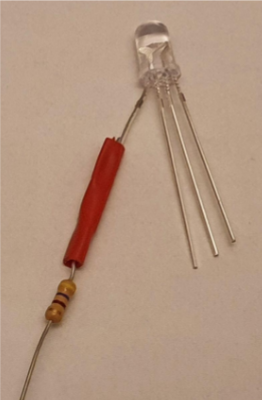
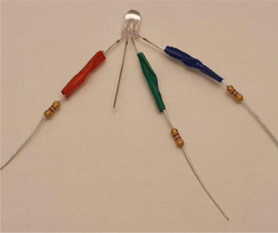

## Rassembler les composants

Tu auras besoin de :
+ 4 x fils de liaison prise-prise, comprenant idéalement un rouge, un vert et un bleu
+ 3 x résistances de même valeur, environ 220 Ohm (100 Ohm ou 470 Ohm conviennent également)
+ 1 × LED RVB à cathode commune
+ Du ruban électrique, n'importe quelle couleur convient
+ Des ciseaux

## Trouver la patte rouge de la LED RVB

Une LED RVB à cathode commune a une patte plus longue qui est la cathode et doit être connectée à la terre (GND). Vérifie les spécifications de ta LED RVB, mais l'ordre des pattes est généralement rouge, cathode (patte plus longue), vert, bleu.

Sépare soigneusement la patte rouge de la LED.

## Enrouler une des pattes de la résistance autour de la patte rouge de la LED

Plie l'une des pattes de la résistance autour de la patte rouge de la LED. Tourne la patte de la résistance autour de la patte de la LED environ trois fois.

## Fixer la résistance avec du ruban isolant

Coupe un petit morceau de ruban isolant et colle-le autour de la résistance torsadée. Cela contribuera à la rendre un peu plus résistante.

## Répéter l'opération pour les jambes vertes et bleues

Ajoute une résistance fixée avec du ruban électrique aux pattes verte et bleue de la LED RVB.

## Fixer les quatre câbles de connexion

Attache un fil de liaison à l'autre extrémité de chaque résistance. Tu peux éventuellement couper environ 1 cm de l'extrémité de chaque fil des résistances pour faciliter l'insertion du fil dans les prises des fils de liaison. Il est utile que les fils de liaison correspondent aux couleurs des pattes, mais ce n'est pas essentiel.

Tu peux également utiliser du ruban électrique supplémentaire pour isoler les pattes de la résistance afin qu'elles ne se touchent pas accidentellement. Cela aidera également à sécuriser les fils de liaison.

Attache l'autre fil de liaison à la patte négative de la LED.

**ASTUCE**: Si des connexions sont desserrées, tu peux les torsader. Tu peux également ajouter plus de ruban électrique autour de tous les fils pour réduire la tension sur les joints.

Tu peux regrouper tous les câbles de connexion et enrouler du ruban électrique autour d'eux, assure-toi de séparer les pattes métalliques et les fils afin qu'ils ne se touchent pas. Si tu as une LED RVB claire, du ruban adhésif invisible peut être utilisé pour diffuser la lumière.

