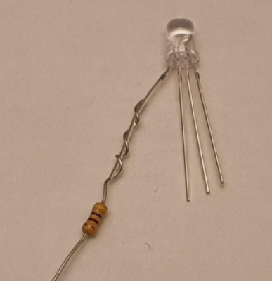
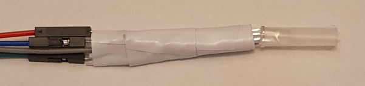

## Verzamel onderdelen

Je hebt nodig:
+ 4 x socket-socket jumperdraden, bij voorkeur rood, groen en blauw
+ 3 x weerstanden van gelijke waarde, ongeveer 220 Ohm (100 Ohm of 470 Ohm is ook prima)
+ 1× RGB-led met gemeenschappelijke kathode
+ Isolatietape, elke kleur is prima
+ Schaar

## Zoek de rode aansluiting van de RGB-led

Een kathode van een RGB-led heeft gewoonlijk één langere poot, de kathode en moet worden aangesloten op aarde (GND). Controleer de specificatie van je RGB-led, maar de volgorde van de poten is meestal rood, kathode (langere poot), groen, blauw.

Neem de rode poot van de LED voorzichtig apart.

## Draai de weerstand rond de rode aansluiting van de LED

Buig een van de poten van de weerstand om de rode aansluiting van de LED. Draai de weerstand drie keer rond de LED-aansluiting.

## Zet de weerstand vast met isolatietape

Knip een klein stukje isolatietape en plak het rond de gedraaide weerstand. Dit zal het een beetje veiliger maken.

## Herhaal dit voor de groene en blauwe aansluitingen

Voeg een weerstand toe die met isolatietape is vastgezet aan de groene en blauwe aansluitingen van de RGB-led.

## Bevestig de vier jumperdraden

Sluit een jumperdraad aan op het andere uiteinde van de weerstand. Je kan ook ongeveer 1 cm van het uiteinde van elke weerstandsdraad afknippen om het gemakkelijker te maken om de draad in de jumperaansluitingen te duwen. Het is handig als de jumperdraden overeenkomen met de kleuren van de poten, maar niet essentieel.

Je kunt ook extra isolatietape gebruiken om de weerstandspoten te isoleren, zodat ze elkaar niet per ongeluk raken. Dit zal ook helpen om de jumperdraden vast te zetten.

Bevestig de andere jumperdraad aan de kathode van de LED.

**TIP**: Als er verbindingen los zitten, kun je deze met draaien vaster zetten. Je kunt ook meer isolatietape rond alle draden toevoegen om de belasting op de verbindingen te verminderen.

Je kunt alle jumperdraden groeperen en er isolatietape omheen wikkelen, zorg ervoor dat je de metalen delen van poten en draden van elkaar scheidt zodat ze elkaar niet raken. Als je een heldere RGB-led hebt, kan transparante plakband worden gebruikt om het licht te verspreiden.

